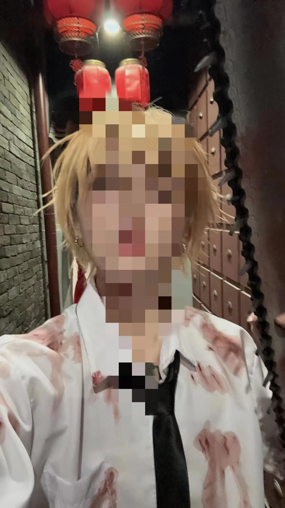

# gap 期间认识的朋友

Created: November 2, 2023 11:30 AM

包桑是我新认识的一个好朋友。

我和她是怎么认识的呢？那还得从自己离开拼多多的时候说起，那时候是真不想继续工作了，看不到任何未来的希望，选择了主动离职。外面的就业环境也可以想象有多艰难，我当时整整窝在家里找了快一个月的工作，每天的状态就是不停地接着下一个面试，有通过的也有没通过的，通过的也是各种预期薪资不满意，每天的状态很差，而且断绝了任何的社交渠道。

这样的状态持续了将近一个半月。我觉得我需要进行社交了，没错，当时我又去了一家附近的剧本杀店，也不看任何内容专挑最便宜的车，我的目的就是和正常人说话。选了一个恐怖内容的游戏，内容没有太多可以说的，唯一的亮点是 DM，人很白很酷，胸口和手上也是纹身，一眼拽拽，看上去就是要掰弯直女的样子，烟枪嗓音，咋形容，就大家看过电锯人没？电锯人里的光熙，就那个感觉！最绝的是有一段她拉我的角色进一个黑房间里。你就想象一下，一个美女粗鲁地拽着你进小黑屋，这哪里让本三次元电次顶得住！

事后我二话不说直接加了联系方式，她也很开朗，有时候有一搭没一搭的聊着，具体的聊天记录就不多说了，整体上就是我知道了她竟然还是个刚毕业的 00 后大学生，跟男朋友毕业后一起来苏州工作，本来是做工程相关后来辞职出来做 DM 了，来上海兼职只是工作，已经在苏州找到了正式岗位了，当时我看她觉得真是个很洒脱的爱玩的年轻人，她也很爱看漫画，比如电锯人都是我们很喜欢的。有时候她经常说有空就让我去她苏州的店里去玩，当时我一直只是把她的行为当做一个拉客消费的话术，毕竟自己印象中 DM 们都是社交大海王。

最近万圣节，听她说他们店里都会弄各种 cosplay 装扮，会很好玩，还说她会 cosplay 电次，让我也来找她玩。我当时随便回了句好呀，没去上班的话我肯定去。因为那个时候我已经找到合适的工作了，随时准备回去当社畜的生活。万圣夜那天，我也还没去工作，也没去应约，结果快晚上的时候，看到她发了个电次的 cosplay 照片，配了句话“真的不到 XXXX（店名）来找电次玩吗”，当时感觉很愧疚，明明做了约定但是自己没去，然后自己打了一串客套的道歉话发给她，她回了句，“没事的，明天还有还有一天”。看完后，我决定明天去一趟苏州。

上海去趟苏州只要半个小时，中午 12 点出发到了目的地只花了一个小时。我看了下店里一个人都没有，到处都是他们昨晚喝剩下的饮料和食物包装。我给包桑发了消息，她说她还没上班，顺便说今天的 cos 妆不比昨晚，我说没事就想看电次老师。

当时就去外面的狮子林转了转，结果一转就到了三点，突然想起自己买了 6 点半的回程，得赶紧抓紧时间。

再次回来到那个店里的时候，我发现了一个昨天照片里看到的一个熟悉的背影，黄头发白衬衫的电次在吃外卖，我凑近一看，喊了句，“包桑？”。她一转头突然看到我吓一跳，一脸惊喜和不好意思，手上的筷子都掉了。虽然我已经事先说过我要来的。我拿出手机开玩笑地说想拍一拍电次，她捂着脸说不好意思怕原生镜头，然后回到里面的屋子里拿出了两把大电锯，摆出了 pose，并且声称让我别拍脸。

虽然我们认识了快两个月了，但这才是我第二次见包桑。该怎么说呢，这回的她虽然全程笑脸但是看上去很害羞，前期聊天的时候不停的摆弄着电次的领带，觉得自己没打好看起来不好看，让做旁边的同事能不能帮她再打打。我不知道是不是我自己印象对她的认知出现了偏差，她不是光熙光海皇吗？

后续她的同事陆续离开，客厅里就剩我和她两个人。后来她逐渐放松了，开始慢慢和我打开话匣子，不停地和我吐槽她的老板，比如不小心在店里拿出了烟被扣了绩效扣钱，算错了顾客的账扣钱，店老板连保洁阿姨都不舍得请之类的。总之她和我说了好多好多，如果说第一次见她，我觉得她像个帅气的光熙，现在见她，就是让人忍不住关心的东山小红，底薪 1750，全靠每天靠拉客带本赚提成，经常干到凌晨，可能一不小心就会被扣钱。幸运地是她说这份工作内容干得还是挺开心的。

感觉她和我聊了好久好久，我就在一边静静地听着，后来她会觉得她怠慢了我，想让别人跟我玩玩扑克什么，其实我只是听得入神了。我看了下时间差不多，刚好她的店老板也来了，不知怎么的，可能看店里多了张不熟悉的脸。店老板拉着包桑和他们的同事一起外面聊天，过了一会儿看包桑都默默地回来后，我对她说要不我充值点钱吧，她立马摇摇头说不用，低声悄悄说你又不玩来趟苏州多麻烦，我临时随口说我这边有亲戚，没事有空可以来玩，总之她坚持不要，不过最后还是在我的要求下，以她的名义拉人头给我充了 600 块。过了一会儿我看时间差不多了，准备离开，她出来送我到楼下，说我这个最后的充值太突然之类的，我一直说没事。到了楼下后她又坚持送我到路口，说竟然以前的认识的人来看她感觉太暖心，我不想让她感到压力，又随口笑着说我只是来看亲戚顺便逛逛狮子林，刚好有个朋友再来看看你的。最后我们不停反复地说了再见后离开了，之后微信上她跟我说了真实姓名（我竟然一直不知道她真名，我也告诉她了我的真名），自己像突然有了个妹妹，顺便叮嘱她好好生活，少熬夜少喝酒少抽烟多攒钱，她说肯定会的。

回去的高铁上，我想了好多好多，不知道为啥每次高铁上思绪就容易放飞，浆糊脑子都会变得文艺起来。并不是所有的东西都适合当做文字记录下来，总之我还是想记录下这段经历，也希望以后如果还有机会见到包桑，她能过得更好，过上她自己当老板开酒吧的日子。

