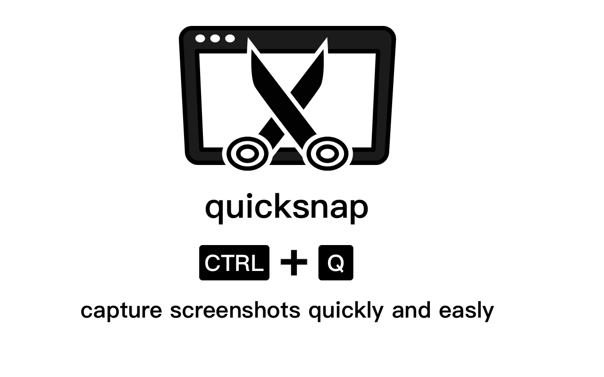

# quicksnap

一款能够快速连续截图的浏览器插件，不会中断你的浏览体验。图片会一直暂存，当你需要的时候，可以选择下载你想要的图片。

特点:

1. 使用 Ctrl+q 就能组合快捷键唤起截图功能，也可以使用右键选择截图选项进行截图。
2. 截图过程中，点击 ESC，就可以取消截图。
3. 截图完毕后，图片就会马上暂存，不会有任何交互消息打扰到你的网页浏览，因此你可以快速的连续截图。
4. 你可以点击插件图标，在插件页面列表中浏览，下载和删除你的图片。
5. 被下载了的图片会自动从暂存中删除。

离线下载地址: [点击下载](../dist.zip)

下载完后是一个压缩包，解压缩后得到一个 dist 文件夹

本地安装 chrome 插件： [点击打开网上教程](https://www.cnblogs.com/xwwin/p/15244217.html)

安装完毕可以正常加载。
