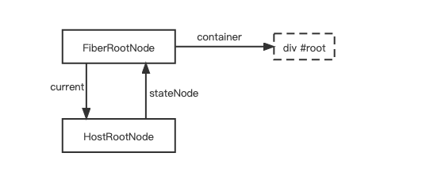
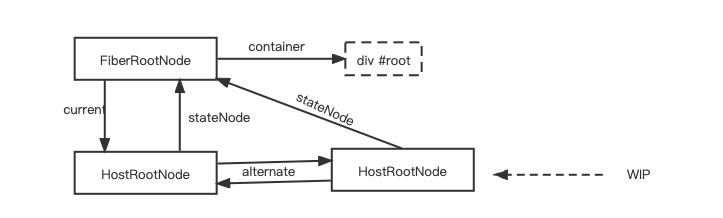
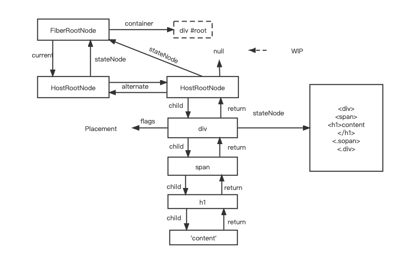
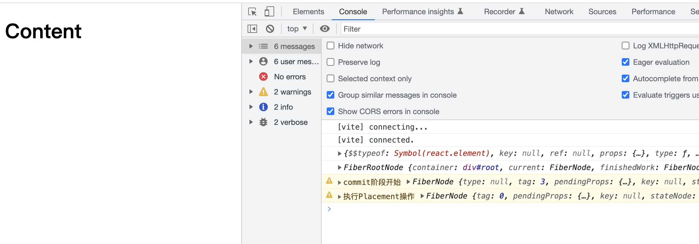

# react 首屏渲染基本原理过程

Created: February 2, 2023 3:04 PM

源码地址: [https://github.com/Hujianboo/react-replica](https://github.com/Hujianboo/react-replica)

以下为 react 常见的挂载方式

```tsx
// 示例1
**import React from 'react';
import ReactDom from 'react-dom/client';

const jsx = (
	<div>
		<h1>
			<span>jsx</span>
		</h1>
	</div>
);
const element = document.getElementById('root');

ReactDom.createRoot(element as Element).render(jsx);**
```

其中的 jsx 部分会经过 babel 转译，直接转成如下形式，实际上我们真正运行的代码应该是这样

```tsx
// 示例2
**import React from 'react';
import ReactDom from 'react-dom/client';
import {jsx as _jsx} from 'react/jsx-dev-runtime' //假设为dev环境下

const jsxFragment = /*#__PURE__*/_jsx("div", {
  children: /*#__PURE__*/_jsx("h1", {
    children: /*#__PURE__*/_jsx("span", {
      children: "jsx"
    })
  })
});
const element = document.getElementById('root');
ReactDom.createRoot(element as Element).render(jsxFragment);**
```

想要使用 jsxFragment，React 必须实现其中的上述的 react/jsx-dev-runtime 中的 jsx 函数（同理也是 createElement).它的作用是创建一个 ReactElement 对象。示意代码如下

```tsx
// 示例3
export const jsxDEV = (type: ElementType, config: any) => {
  let key: Key = null;
  const props: Props = {};
  let ref: Ref = null;
  //xxxx 省略
  return createReactElement(type, key, ref, props);
};
//创建一个ReactElement对象
const createReactElement = function (
  type: Type,
  key: Key,
  ref: Ref,
  props: Props
): ReactElementType {
  // 返回一个ReactElement对象
  const element = {
    $$typeof: REACT_ELEMENT_TYPE, // ReactElement的Symbol的标记
    type, // jsx函数的第一个传参，比如'div','h1',() => {}
    key,
    ref,
    props,
  };
  return element;
};
```

了解了 ReactElement 后，我们重新回到示例 2 代码，其中的 ReactDom.createRoot 会接收一个 dom 参数，并且返回一个带 render 函数的对象

```tsx
// 示例4
//react-dom/root.ts
import {
  createContainer,
  updateContainer,
} from "react-reconciler/src/fiberReconciler";
import { ReactElementType } from "shared/ReactTypes";
import { Container } from "./hostConfig";

export function createRoot(container: Container) {
  const root = createContainer(container);
  return {
    render(element: ReactElementType) {
      updateContainer(element, root);
    },
  };
}
```

其中的 createContainer 函数会将外部传进的 dom 生成一个 FiberRootNode 和一个 FiberNode（后面也称为 HostRootFiber).并且将这个 FiberRootNode 作为返回参数。



```tsx
//示例5
// fiberReconciler.ts
export function createContainer(container: Container) {
  const hostRootFiber = new FiberNode(HostRoot, {}, null);
  const root = new FiberRootNode(container, hostRootFiber);
  hostRootFiber.updateQueue = createUpdateQueue();
  return root;
}

export function updateContainer(
  element: ReactElementType | null,
  root: FiberRootNode
) {
  const hostRootFiber = root.current;
  const update = createUpdate<ReactElementType | null>(element);
  // debugger;
  enqueueUpdate(
    hostRootFiber.updateQueue as UpdateQueue<ReactElementType | null>,
    update
  );
  scheduleUpdateOnFiber(hostRootFiber);
  return element;
}
```

回到之前的 createRoot 函数，当其返回的 render 函数执行的时候，就会执行 updateContainer 函数，它接收 ReactElement 对象和上面创建的 FiberRootNode 对象。updateContainer 内首先会整颗 ReactEment 树通过 update 的对象的方式传递 hostRootFiber,只是正式从 scheduleUpdateOnFiber 上开始进行 fiber 树的生成。scheduleUpdateOnFiber 会进行 fiber 的更新调度，这里我们先简略这一部分步骤,先看下是如何生产渲染的，调度完成后就会直接执行 renderRoot 函数

```tsx
import { beginWork } from "./beginWork";
import { commitMutationEffects } from "./commitWork";
import { completeWork } from "./completeWork";
import { createWorkInProgress, FiberNode, FiberRootNode } from "./fiber";
import { MutationMask, NoFlags } from "./fiberFlags";
import { HostRoot } from "./workTags";

let workInProgress: FiberNode | null = null;

function prepareFreshStack(root: FiberRootNode) {
  workInProgress = createWorkInProgress(root.current, {});
}

export function scheduleUpdateOnFiber(fiber: FiberNode) {
  //省略调度
  renderRoot(root);
}

function renderRoot(root: FiberRootNode) {
  // 初始化
  prepareFreshStack(root);

  do {
    try {
      workLoop();
      break;
    } catch (e) {
      if (__DEV__) {
        console.warn("workLoop发生错误", e);
      }
      workInProgress = null;
    }
  } while (true);

  const finishedWork = root.current.alternate;
  root.finishedWork = finishedWork;
  // commitRoot(root);
}

function workLoop() {
  while (workInProgress !== null) {
    performUnitOfWork(workInProgress);
  }
}

function performUnitOfWork(fiber: FiberNode) {
  // debugger;
  const next = beginWork(fiber);
  fiber.memoizedProps = fiber.pendingProps;
  // debugger
  if (next === null) {
    completeUnitOfWork(fiber);
  } else {
    workInProgress = next;
  }
}

function completeUnitOfWork(fiber: FiberNode) {
  let node: FiberNode | null = fiber;

  do {
    completeWork(node);
    const sibling = node.sibling;

    if (sibling !== null) {
      workInProgress = sibling;
      return;
    }
    node = node.return;
    workInProgress = node;
  } while (node !== null);
}
```

renderRoot 函数中首先会创建一个名为 workInProrgress 的 FiberNode 节点，之后我们简称为 wip。

```tsx
export const createWorkInProgress = (
  current: FiberNode,
  pendingProps: Props
): FiberNode => {
  let wip = current.alternate;
  // debugger;
  if (wip === null) {
    // mount
    wip = new FiberNode(current.tag, pendingProps, current.key);
    wip.stateNode = current.stateNode;

    wip.alternate = current;
    current.alternate = wip;
  } else {
    // update
    wip.pendingProps = pendingProps;
    wip.flags = NoFlags;
    wip.subtreeFlags = NoFlags;
  }
  wip.type = current.type;
  wip.updateQueue = current.updateQueue;
  wip.child = current.child;
  wip.memoizedProps = current.memoizedProps;
  wip.memoizedState = current.memoizedState;

  return wip;
};
```

因为此时 HostRootNode 没有 alternate,因此直接进入其中的挂载流程，最后生成一个 wip 并返回。整体的流程状态图如下所示，



在 workLoop 中，只要 wip 不为 null,就会不停地执行 performUnitOfWork,其具体内容就是进行 dfs，不停地从上向下递归生成 fiber 树，并且给对应的 fiber 贴上对应的操作标签，比如 Placement,代表插入或者移动，当生成完毕后，再从下至上地根据 fiber 节点和对应的操作标签，生成对应的 dom 树。这里将 performUnitOfWork 拆分成了两个部分，并且使用的是循环实现。一个是 beginWork，一个是 completeWork,前者负责从上到下的部分，后者负责从下到上的部分。

```tsx
function performUnitOfWork(fiber: FiberNode) {
  const next = beginWork(fiber);
  fiber.memoizedProps = fiber.pendingProps;

  if (next === null) {
    completeUnitOfWork(fiber);
  } else {
    workInProgress = next;
  }
}
export const beginWork = (wip: FiberNode) => {
  // 比较，返回子fiberNode
  switch (wip.tag) {
    case HostRoot:
      return updateHostRoot(wip);
    case HostComponent:
      return updateHostComponent(wip);
    case HostText:
      return null;
    case FunctionComponent:
      return updateFunctionComponent(wip);
    default:
      break;
  }
  return null;
};
function updateFunctionComponent(wip: FiberNode) {
  const nextChildren = renderWithHooks(wip);
  reconcileChildren(wip, nextChildren);
  return wip.child;
}
function updateHostRoot(wip: FiberNode) {
  const baseState = wip.memoizedState;
  const updateQueue = wip.updateQueue as UpdateQueue<Element>;
  const pending = updateQueue.shared.pending;
  updateQueue.shared.pending = null;
  const { memoizedState } = processUpdateQueue(baseState, pending);
  wip.memoizedState = memoizedState;

  const nextChildren = wip.memoizedState;
  reconcileChildren(wip, nextChildren);
  return wip.child;
}

function updateHostComponent(wip: FiberNode) {
  const nextProps = wip.pendingProps;
  const nextChildren = nextProps.children;
  reconcileChildren(wip, nextChildren);
  return wip.child;
}

export const completeWork = (wip: FiberNode) => {
  const newProps = wip.pendingProps;
  const current = wip.alternate;

  switch (wip.tag) {
    case HostComponent:
      if (current !== null && wip.stateNode) {
        // update
      } else {
        // 1. 构建DOM
        const instance = createInstance(wip.type);
        // 2. 将DOM插入到DOM树中
        appendAllChildren(instance, wip);
        wip.stateNode = instance;
      }
      bubbleProperties(wip);
      return null;
    case HostText:
      if (current !== null && wip.stateNode) {
        // update
      } else {
        // 1. 构建DOM
        const instance = createTextInstance(newProps.content);
        wip.stateNode = instance;
      }
      bubbleProperties(wip);
      return null;
    case FunctionComponent:
      bubbleProperties(wip);
      return null;
    case HostRoot:
      bubbleProperties(wip);
      return null;

    default:
      break;
  }
};

function appendAllChildren(parent: Container, wip: FiberNode) {
  //省略
}

function bubbleProperties(wip: FiberNode) {
  let subtreeFlags = NoFlags;
  let child = wip.child;

  while (child !== null) {
    subtreeFlags |= child.subtreeFlags;
    subtreeFlags |= child.flags;

    child.return = wip;
    child = child.sibling;
  }
  wip.subtreeFlags |= subtreeFlags;
}
```

这里为了简单起见，暂时先不考虑存在兄弟节点的情况，最终，会生成如下一颗 fiber 树和一颗离屏渲染出的一棵树。



在这只之后，React 会进行 Commit 操作，将这颗离屏渲染树渲染到 id 为 root 的 dom 上，在 completeWork 过程中会对每个 fiber 的子节点的 flags 进行收集，统一放在 subTreeFlags 里，因此当 Commit 首屏渲染时，会发现 HostRootNode 的 SubTreeFlags 为 Placement,向下寻找时发现正好为第一个子 Fiber 需要插入，且再往下发现 subTreeFlags 都为 0。最后直接插入整棵 dom 树，渲染成功。


