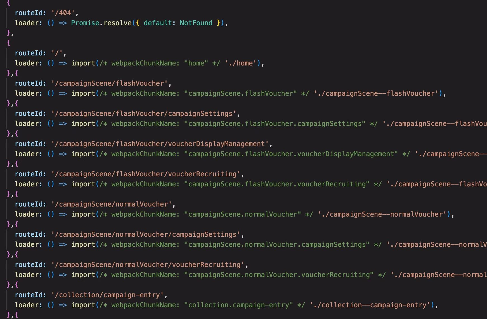
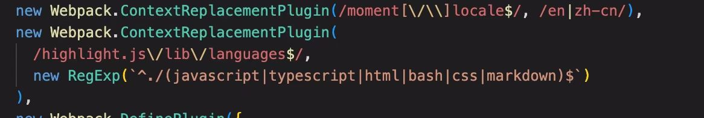
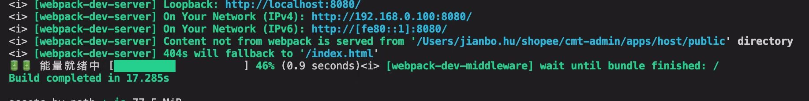
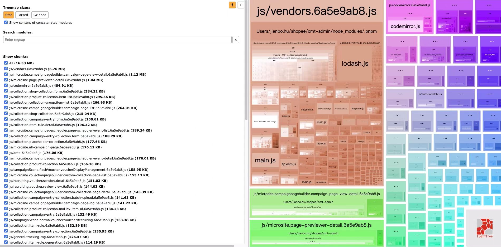

# 一次大型老旧前端项目的构建改造

## **背景介绍**

国庆前的一次发版，七八个人开发了一个月的feature和部分迁移过来的大型功能要在这一次同时上线，导致这次合并后代码量激增。因为这个项目整体可以认为是一个接手过来的老旧项目，本身其内置的工具版本过低无法优化。之前一次在M1芯片上的构建就需要3min,合完代码后接近8min,在公司的构建平台上一个地区部署就花了接近30min，还需要部署10多个地区，这让构建平台本就孱弱的性能雪上加霜。这种情况是当时我们所有人都没有想到的，为了大家的假期愉快 : -) 最后我们勉强挨个地区的部署上线算是过了这一关。国庆后我和另一个同事一起分头行动（他优化老的工具链，我则将老的工具链完全替换成webpack5或者vite，最后哪种方案可行用哪种）,准备把这个老旧项目的构建改造一下，提升下组内大家的开发体验。

## 项目之前存在的构建弊端

1. **没有充分地利用动态导入方式对构建产物进行分解，导致单个产物过大**。webpack对于动态导入的模块是能够单独分包处理的，我们完全可以利用这个特性，对不同的页面进行分包，比如在路由侧对页面进行性能优化。
    
  
    
2. **没有很好利用TreeShaking 特性**。（TreeShaking相关的可以看自己的上一篇文章 [https://hujianbo.xyz/posts/什么是tree-shaking](https://hujianbo.xyz/posts/%E4%BB%80%E4%B9%88%E6%98%AFtree-shaking) ）。首先提一下这个项目的是一个大型的monorepo结构，大家都在各自的包内开发，然后在主应用包内导入。这里就出现了一个问题，大家对于TreeShaking的特性不太熟，导出的方式使用问题上无法实现treeshaking.比如最常见的 
```jsx
//某位同事的开发包的导出，实际只需要用到a。但这种导出方式会将这个包都打入构建产物中。
export deafult {
a,
b,
c,
....
}
``` 

3. **重复打包**。老的构建工具没有使用将多个包中相同版本的第三方库，无法将antd,loadsh抽离成单独的公共包，导致反复打包，让最后的构建产物体积剧增。
4. **部分大型的库没有按需剔除**。比如moment这种库，我们通知只需要英文和中文即可，完全没必要整体使用。



上述四点是最主要的弊端了。剩下的还有一堆的小毛病，dev冷启动过慢等等。

## **webpack5改造**

整体上思路上，自己首先用webpack5将这个项目重新跑起来。之后再根据上述的四个点进行逐一优化，最后在比较利用一些工具比如BundleAnalyze来分析改造前和改造后的打包体积，速度以及线上构建时间等等。

最后 

冷启动时间：从原先的1m52s 降为了目前的15s上下(冷启动，m1芯片)

生产速度： 从原先的360s 降为了目前的36s（m1芯片）

打包体积:  从原先的 692.1M降为了目前的20M

线上构建： 从原先的平均17min一个地区变为了2min一个地区





最后复盘采纳webpack5的改造方式，彻底抛弃之前的老旧工具链。

整体的历程其实非常艰辛 - -，但是写出来可能又过于流水账，其实对大家帮助也并不大。这里就将一些自己的经验写一下

对于分包，其实并不需要手动指定。因为目前的webpack5对于默认拆分chunk的能力已经完全足够了，手动在cachGroup指定某些包时公共chunk并不一定能达到很好地效果。因此我在这会改造中完全没有手动指定分包，并且手动指定分包后的体积实际上也并没有减少。。其次在开发环境上，大家可以使用新的如esbuild-loader和swc-loader来处理相关的ts文件，减少启动时间，但是默认线上配置务必还是使用babel。剩下的比如使用构建缓存，css提取等常见问题不多赘述了，网上资料太多。

## 其它这类改造项目的注意点

1. **构建工具选择？** webpack5 ,vite , turbopack

这里我选择的是webpack5,首先因为之前的构建工具其实也是根据低版本的webpack封装的。那么自己选用webpack5的好处在于可以把改造变相拆分为升级旧工具链的webpack依赖+展开它，虽然能够还是免不了踩一堆坑，但相对来说好很多。其次至于自己为什么不选用vite，还是因为自己无法保证一定其bundless的开发方式和bundle的真实构建是完全一致的，为了保险起见，不选用。至于turbopack，其实我们刚开始改造的时候它还没出现。。改造到差不多的时候它既然出现了，粗略地了解了下，它的快在于机器码比动态语言快，但是却没了插件机制，等什么时候有了类似webpack一样的tapable机制再说吧。

2. **样式的处理**

如果一个项目使用sass或者less,统一使用css module或者全局方式是，这样的话是最理想的，最多在处理样式的loader编写时记得做正则区分即可。现在的项目大部分都是使用sass,部分使用全局样式，然后大家使用的css module既有具名导出有默认导出的，这在最近一两年的css-loader是无法默认允许的。因此对于这种情况，挨个写loader实在过于复杂，个人建议直接写一个聚合函数，处理一切情况，比如这样

```tsx
interface Props {
  useCSSinJS?: boolean;
  isCssModule?: boolean;
  isScss?: boolean;
  isLess?: boolean;
  isProduction?: boolean;
  isWithTypeScript?: boolean;
  CSSHash?: string;
}
export function getStyleLoaders({
  // useCSSinJS = false,
  isCssModule = false,
  isScss = false,
  isLess = false,
  isProduction = false,
  isWithTypeScript = false,
  CSSHash,
}: Props): RuleSetUse {
  const HASH_ONLY = '[hash:base64:8]';
  const HASH_WITH_PATH = '[path][name]_[local]--' + HASH_ONLY;
  const showCSSHash = CSSHash && isString(CSSHash) ? CSSHash : HASH_ONLY;
  return [
    'style-loader',
    !isProduction &&
      isCssModule &&
      isWithTypeScript &&
      'css-modules-typescript-loader',
    {
      loader: 'css-loader',
      options: {
        modules: isCssModule
          ? {
              localIdentName: isProduction ? showCSSHash : HASH_WITH_PATH,
            }
          : false,
        sourceMap: !isProduction,
        importLoaders: 1,
        // localsConvention: "camelCase",
      },
    },
    isLess && {
      loader: 'less-loader',
      options: {
        lessOptions: {
          javascriptEnabled: true,
        },
      },
    },
    isScss && {
      loader: 'sass-loader',
      options: {
        // Prefer `dart-sass`
        implementation: require('sass'),
      },
    },
  ].filter(truthy);
}
```

如果上面是内因的话，还有外因，项目中竟然使用了一些没有处理less sass这类第三方库,因此，**切记需要检查一下你的项目里是否也有这种类似的情况**，记得额外，处理一下这种第三方库，否则线上页面崩了到时候就有苦喊不出了 :-)。

```tsx
{
        test: /\.scss$/,
        use: [
          'style-loader',
          'css-modules-typescript-loader',
          {
            loader: 'css-loader',
            options: {
              modules: {
                localIdentName: HASH_WITH_PATH,
                namedExport: true,
              },
              sourceMap: false,
              importLoaders: 1,
            },
          },
          {
            loader: 'sass-loader',
            options: {
              implementation: require('sass'),
            },
          },
        ],
        include: /@xxxxxxx/, //某不合规第三方库，额外处理下
      },
```

3. **检查老旧项目中是否存在构建变量注入的地方，及时替换**

这在一些大型项目中很常见，比如运行环境，地区等是通过构建编译时候注入的，记得通过在webpack插件中使用DefinePlugin注入，比如

```tsx
new Webpack.DefinePlugin({
      __ENV__: JSON.stringify(ENV),
      __NODE_ENV__: JSON.stringify(NODE_ENV),
      __LOCALE__: JSON.stringify(LOCALE),
      __PUBLIC_PATH__: JSON.stringify(PUBLIC_PATH),
      __GIT_HASH__: JSON.stringify(GIT_HASH),
    }),
```

1. **检查改造后静态图片等资源是否仍然在它“应该的”位置上，记得和原来保持一致**

这个没什么好多讲的，但是非常容易遗漏，比如我这次差点就忘了。。、

```tsx
new CopyWebpackPlugin({ //将用到的相关静态资源复制到最后构建产物中
      patterns: [
        {
          from: path.resolve(__dirname, '../static/microsite'),
          to: path.resolve(__dirname, '../dist/microsite'),
        },
        {
          from: path.resolve(__dirname, '../static/favicon.ico'),
          to: path.resolve(__dirname, '../dist'),
        },
        {
          from: path.resolve(__dirname, '../static/shopee.svg'),
          to: path.resolve(__dirname, '../dist'),
        },
      ],
    }),
```

4. **不要滥用tree shaking,请保证所有功能特性没有依赖副作用**

这次改造中出现了一个小问题，因为我们对所有庞大细枝末节的不了解和过于乐观，对整体的所有包都添加了sideEffect:false,导致某个利用了文件副作用来实现某个功能的包出现了问题，还好及时发现进行了修复。虽然极不推荐利用副作用实现功能，但是我们无法保证所有人都这样子去做。因此还是有必要做好检查

5. **改造完成后务必让测试回归**

这种改造必定会对原来的代码产生巨量的影响，比如在这次改造中为了treeshaking和样式处理批量动到上千个文件，小伙伴们纷纷表示这样子改动会不会影响原有功能，毕竟这是个单测都没有的老项目。但是越是这种时候，个人自信务必非常重要。面对质疑一定要相信自己没问题，因为只有狠狠动刀破坏，才能重新创造。