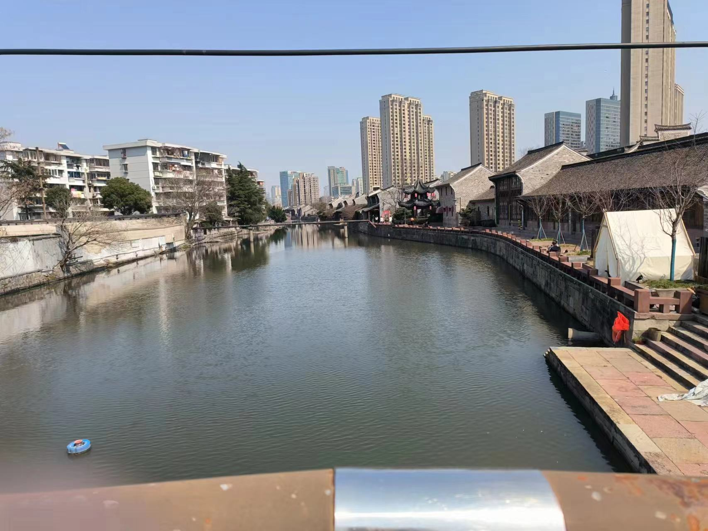
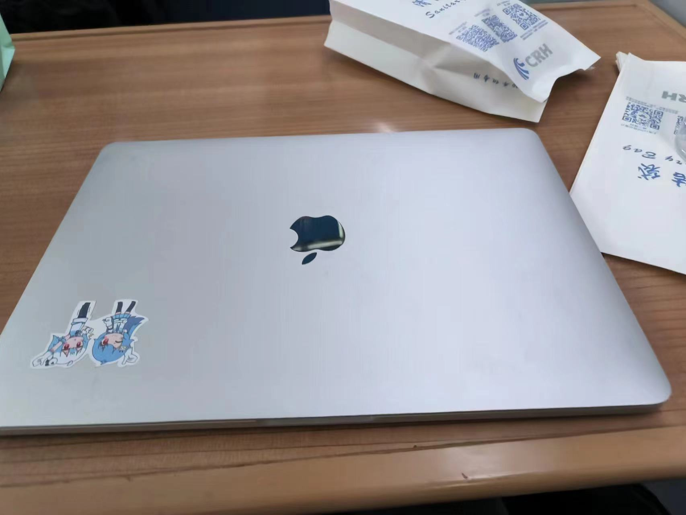

# 宁波之旅

Created: March 4, 2023 12:40 AM

3 月 2 号去了趟宁波。

自己家乡在宁海县，其实自己就是宁波人。但除了小学的时候在鄞州区上过半年学外，就再没去过宁波市区，这可以算是我二十多年来第一次去。

下了火车，偌大的城市感觉空荡荡的，也许是工作日的关系，马路上都没什么人。

因为和别人预订的时间是 2 点，当时还有 2 个小时，想在附近找个吃的地方，我整整走了 1 个小时都找不到一个饭馆！！这个市中心就像是一个偌大的美丽公园，看着是真漂亮，但不给下了火车的游客们歇脚的地方吗？（开几个星巴克也行呀 - - ）

但不得不说风景确实不错，我就这样一边吃着便利店买的面包，一边站在河边看着风景。

这次来主要是参加一个的小而美公司的面试的，它的产品其实很多人都免费在用，只是大家平常没注意到而已。时间到点进了公司，公司只占一层楼，大概不到 50 人的样子，大家的整体精神面貌都很好。面试流程也很快，技术面完马上就是 HR 面试，之后就是 ceo 面试。ceo 看起来应该是个 50 岁左右的中年人，谈吐舒服气质儒雅，但是明显又能从眼神中感受到一种开放的精神，给人一种就像是年轻的互联网程序员和老干部结合体，和他的面试就像放松的聊天。整体过程中大致了解到他们公司的发展，长期的克制定位，能够持续盈利的原因。总之听他讲完自己内心很震撼，也对自己的心浮气躁很羞愧。面完试以后，我打消了回老家躺平的念头，本来还想在附近酒店休息一晚的，改成直接订了回上海的火车，开始写起了 qq 群里接的没写完的外包。还是要对自己的目标长期有信心，也能够克制一点过火的激情。

