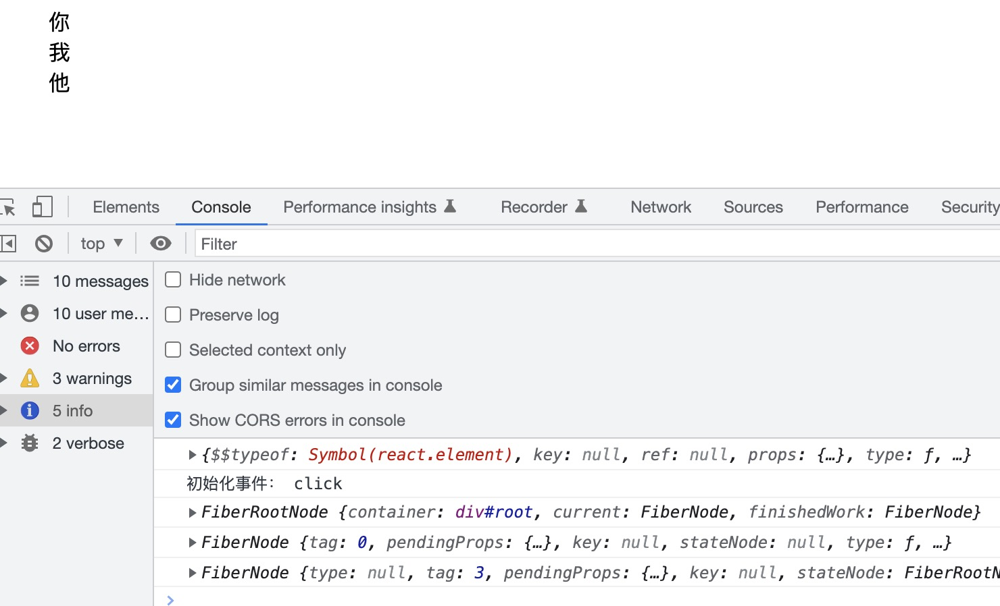
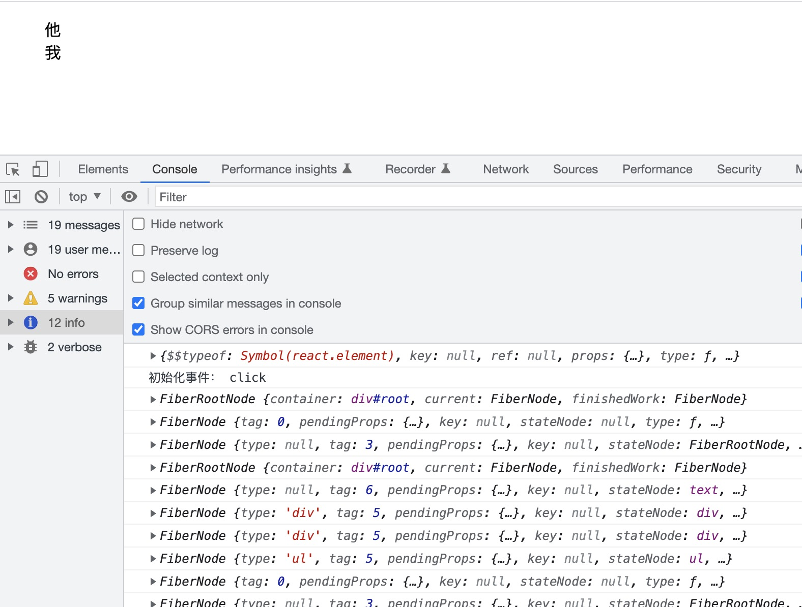

# 实现 reconciler 中的 diff 算法

Created: February 12, 2023 4:58 PM

源码地址: [https://github.com/Hujianboo/react-replica](https://github.com/Hujianboo/react-replica)

## Diff 实现

diff 实现是 reconciler 中的重要部分，主要的作用是在 beginWork 中，需要对 fiber 节点的删除和插入做标记。reconciler 的本质是 ReactElement 和当前 Fiber 节点做比对生成新的 Fiber，因为这样子的大范围比对的时间复杂度非常高，为 3 次方。为了降低时间复杂度只线性复杂度，react 的 diff 为预设三个限制:

1. 只对同级元素做 diff。
2. 某个元素的类型发生改变，即就销毁并重建。
3. 开发者通过 key 来对子元素进行标记表示其唯一性。

这里会分成两种情况：单节点 diff 和多节点 diff

### **单个 ReactElement:**

key 相同，type 相同，这个 Fiber 可以复用，剩下的兄弟节点所有要删除

key 相同，type 不同 不能复用，并且所有节点都标记为删除

key 不同 不能复用 删除掉该节点，然后用它的兄弟重新遍历

```tsx
// update
			if (currentFiber.key === key) {
				// key相同
				if (element.$$typeof === REACT_ELEMENT_TYPE) {
					if (currentFiber.type === element.type) {
						// type相同
						const existing = useFiber(currentFiber, element.props);
						existing.return = returnFiber;
						deleteRemainingChildren(returnFiber, currentFiber.sibling);
						return existing;
					}
					deleteRemainingChildren(returnFiber, currentFiber);
					break;
				} else {
					//省略
				}
```

### 多个 ReactElement(数组)：

一般进行 2 轮遍历，分多种情况讨论，最理想的情况是 newChild 和原 fiber 数组全部遍历完并且都可复用，此时直接结束，最复杂的情况都是 newChild 和 fiber 数组都没遍历完，说明节点的位置发生了移动，都不能复用，因此我们将剩下的原 fiber 数组存放到一个 map 中,以 fiber 的 key 值或者 index 值作为键值，然后开始第二轮遍历，从上次的中断位置开始，对每个 ReactElement 生成新的 Fiber,新位置和 map 中旧的 Fiber 的位置进行比对，首先判断其是否可复用，再判断其是否移动位置（通过当前使用了的最后一个未做插入动作的旧 Fiber 作为参照点），对其打上 Placement 标签，遍历完毕后，就将 map 中剩余的元素全部打上 Deletion 标签。

这个是官方的实现方式，因为在第一轮遍历和第二轮遍历中，我们都会对元素是否能够复用做判断，其实一开始就将全部旧 fiber 元素塞到 map 里，然后每次取旧 fiber 的方法里去判断 fiber 能够是否复用，若能复用则返回 map 里的值，并删除该 key。若不能，则产生一个新的 Fiber 返回,遍历完毕后，对所有 map 里的 Fiber 打上 Deletion 标签。

```tsx
function reconcileChildrenArray() {
  // 省略
  for (let i = 0; i < newChild.length; i++) {
    const after = newChild[i];
    const newFiber = updateFromMap(returnFiber, existingChildren, i, after);

    const current = newFiber.alternate;
    if (current !== null) {
      const oldIndex = current.index;
      if (oldIndex < lastPlacedIndex) {
        // 移动
        newFiber.flags |= Placement;
        continue;
      } else {
        // 不移动
        lastPlacedIndex = oldIndex;
      }
    } else {
      // mount
      newFiber.flags |= Placement;
    }
  }
}
function updateFromMap() {
  // 省略
  // ReactElement
  if (typeof element === "object" && element !== null) {
    switch (element.$$typeof) {
      case REACT_ELEMENT_TYPE:
        if (before) {
          if (before.type === element.type) {
            existingChildren.delete(keyToUse);
            return useFiber(before, element.props);
          }
        }
        return createFiberFromElement(element);
    }
  }
}
```

## Commit 阶段

当我们对 Fiber 标签标记了以后，commit 阶段就会对我们的标签进行具体的 Dom 操作。我们总共的归类可以分为 Deletion，Placement,Update 三种，其中 Update 指的是元素内的文字内容或者标签发生了改变，前两种都是元素的增删移动。

```tsx
const commitMutaitonEffectsOnFiber = (finishedWork: FiberNode) => {
  const flags = finishedWork.flags;
  if ((flags & Placement) !== NoFlags) {
    commitPlacement(finishedWork);
    finishedWork.flags &= ~Placement;
  }
  // flags Update
  if ((flags & Update) !== NoFlags) {
    commitUpdate(finishedWork);
    finishedWork.flags &= ~Update;
  }
  // flags ChildDeletion
  if ((flags & ChildDeletion) !== NoFlags) {
    const deletions = finishedWork.deletions;
    if (deletions !== null) {
      deletions.forEach((childToDelete) => {
        commitDeletion(childToDelete);
      });
    }
    finishedWork.flags &= ~ChildDeletion;
  }
};
```

在 React18.2 的源码中，commit 操作中还会对不同类型的 Fiber 做出不同的区分操作，这里不再对细分。

### Demo




