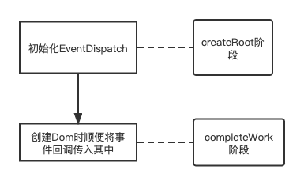
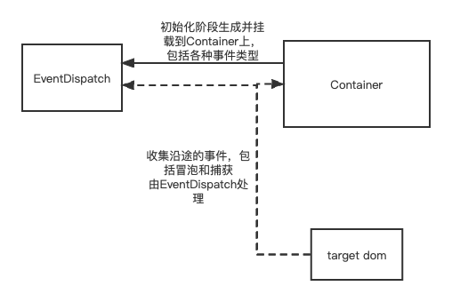
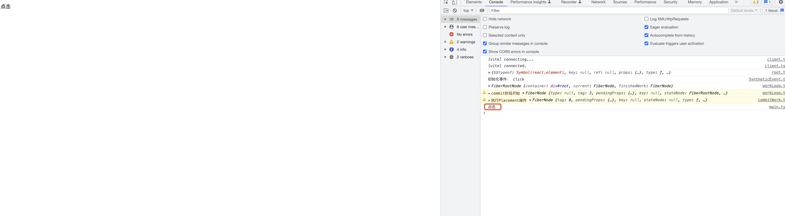

# 实现合成事件

### **类似实现**

源码地址: [https://github.com/Hujianboo/react-replica](https://github.com/Hujianboo/react-replica)

在 createRoot 开始阶段，我们会初始化事件分发中心，并且将其所有的事件类型，在 Container 上监听一遍，在 completeWork 阶段创建真实 dom 的时候，将事件回调函数直接挂在真实 dom 的某个属性上，比如就叫 \_\_props 它里面存放每个 ReactElement 上的 props。

```tsx
const elementPropsKey = "__props";
interface DomElement extends Element {
  [elementPropsKey]: Props;
}
export function updateFiberProps(node: DOMElement, props: Props) {
  node[elementPropsKey] = props;
}
```

updateFiberProps 函数会赋值或者更新 dom 节点的\_\_props 属性值。我们需要在创建和更新 dom 节点的时候去调用它，也就是在 complete 阶段。

```tsx
case HostComponent:
			if (current !== null && wip.stateNode) {
				// update
				updateFiberProps(wip.stateNode, newProps);
			} else {
				// mount
				const instance = createInstance(wip.type, newProps);
				appendAllChildren(instance, wip);
				wip.stateNode = instance;
			}
			bubbleProperties(wip);
			return null;
```



至此，准备工作完毕。当用户进行交互，比如点击了一个带 onClick 的 ReactElement 按钮时，原生事件会不断地冒泡至 Container，触发了 EventDispatch 中 click 的事件回调



```tsx
function dispatchEvent(container: Container, eventType: string, e: Event) {
  const targetElement = e.target;

  if (targetElement === null) {
    return;
  }

  // 1. 收集事件
  const { bubble, capture } = collectPaths(
    targetElement as DOMElement,
    container,
    eventType
  );
  // 2. 构造合成事件
  const se = createSyntheticEvent(e);

  // 3. 遍历captue和bubble
  triggerEventFlow(capture, se);
  //如果
  if (!se.__stopPropagation) {
    triggerEventFlow(bubble, se);
  }
}
```

该回调里面是一个执行所有合成事件的方法,它主要做四件事情，1.收集从 target Dom 到 Container 的所有沿途的事件 2.构造生成合成事件 3.遍历执行所有的捕获事件和冒泡事件。

```tsx
function collectPaths(
  targetElement: DOMElement,
  container: Container,
  eventType: string
) {
  const paths: Paths = {
    capture: [],
    bubble: [],
  };

  while (targetElement && targetElement !== container) {
    // 收集
    const elementProps = targetElement[elementPropsKey];
    if (elementProps) {
      // click -> onClick onClickCapture
      const callbackNameList = getEventCallbackNameFromEventType(eventType);
      if (callbackNameList) {
        callbackNameList.forEach((callbackName, i) => {
          const eventCallback = elementProps[callbackName];
          if (eventCallback) {
            if (i === 0) {
              // capture
              paths.capture.unshift(eventCallback);
            } else {
              paths.bubble.push(eventCallback);
            }
          }
        });
      }
    }
    targetElement = targetElement.parentNode as DOMElement;
  }
  return paths;
}
```

首先 collectPaths 根据传入的 targetElement,不停向上循环遍历直到 container,在循环中会收集每个 dom 的事件回调，同时收集捕获事件和冒泡事件，存放到对应数组中。

```tsx
function createSyntheticEvent(e: Event) {
  const syntheticEvent = e as SyntheticEvent;
  syntheticEvent.__stopPropagation = false;
  const originStopPropagation = e.stopPropagation.bind(e);

  syntheticEvent.stopPropagation = () => {
    syntheticEvent.__stopPropagation = true;
    if (originStopPropagation) {
      originStopPropagation();
    }
  };
  return syntheticEvent;
}
```

接下来我们要创建合成事件。因为虽然得到了所有的冒泡和捕获事件，但是却还需要实现一些别的特性，比如阻止冒泡这种行为，在触发收集的事件时，我们就通过合成事件来判断是否有阻止冒泡行为。这里很简单，直接给对象时间添加一个**stopPropagation 的布尔属性。并且改写原来的 stopPropagation，当执行 stopPropagation 时，将**stopPropagation 的值变为 true,并且执行原来事件对象里的 stopPropagation 函数。

```tsx
function triggerEventFlow(paths: EventCallback[], se: SyntheticEvent) {
  for (let i = 0; i < paths.length; i++) {
    const callback = paths[i];
    callback.call(null, se);

    if (se.__stopPropagation) {
      break;
    }
  }
}
```

最后触发所有的收集到的事件。triggerEventFlow 会遍历事件数组，然后取出里面事件执行，并且传参为我们构建的合成事件，其中执行完毕后，如果合成事件的\_\_stopPropagation 的为 true,代表阻止事件传递下去，这里就直接 break 跳出循环。

这里我们用个小 demo 实际验证一下效果

```tsx
const App = () => {
  const [num, setNum] = useState(10000);
  const [num1, setNum1] = useState(100086);
  return (
    <p>
      <div
        onClick={() => {
          console.log("父亲被冒泡触发");
        }}
      >
        <div
          onClick={(e) => {
            console.log("点击");
            // 阻止事件传递
            e.stopPropagation();
          }}
        >
          点击
        </div>
      </div>
    </p>
  );
};
```

实际效果如下，所示，可以看到成功触发点击事件，并且阻止了事件传递，父亲组件的 click 回调没有被触发。



### **react18 的事件实现**

先讲一下 react18.2 的事件系统是怎么样的，首先和我们类似，都是在 createRoot 初始化事件系统。

```tsx
export function createRoot(
  container: Element | Document | DocumentFragment,
  options?: CreateRootOptions
): RootType {
  //xxxxx

  listenToAllSupportedEvents(rootContainerElement);
}
```

listenToAllSupportedEvents 是 18.2 事件系统中用来给 Container 注册事件的，

```tsx
export function listenToAllSupportedEvents(rootContainerElement: EventTarget) {
  if (!(rootContainerElement: any)[listeningMarker]) {
    (rootContainerElement: any)[listeningMarker] = true;
    allNativeEvents.forEach(domEventName => {
      // We handle selectionchange separately because it
      // doesn't bubble and needs to be on the document.
      if (domEventName !== 'selectionchange') {
				//如果事件支持冒泡
        if (!nonDelegatedEvents.has(domEventName)) {
          listenToNativeEvent(domEventName, false, rootContainerElement);
        }
				//监听捕获事件
        listenToNativeEvent(domEventName, true, rootContainerElement);
      }
    });
    const ownerDocument =
      (rootContainerElement: any).nodeType === DOCUMENT_NODE
        ? rootContainerElement
        : (rootContainerElement: any).ownerDocument;
    if (ownerDocument !== null) {
      // The selectionchange event also needs deduplication
      // but it is attached to the document.
      if (!(ownerDocument: any)[listeningMarker]) {
        (ownerDocument: any)[listeningMarker] = true;
        listenToNativeEvent('selectionchange', false, ownerDocument);
      }
    }
  }
}
```

其中的 nonDelegatedEvents 是不支持委托也就是不支持冒泡事件的集合，listenToNativeEvent 的作用是将原生事件绑定到 dom 上，捕获和冒泡的区分逻辑可看上面注释，两个唯一的区别就是在于给 listenToNativeEvent 的第二个参数传参布尔值不同而已。

```tsx
export function listenToNativeEvent(
  domEventName: DOMEventName,
  isCapturePhaseListener: boolean,
  target: EventTarget
): void {
  if (__DEV__) {
    if (nonDelegatedEvents.has(domEventName) && !isCapturePhaseListener) {
      console.error(
        'Did not expect a listenToNativeEvent() call for "%s" in the bubble phase. ' +
          "This is a bug in React. Please file an issue.",
        domEventName
      );
    }
  }

  let eventSystemFlags = 0;
  if (isCapturePhaseListener) {
    eventSystemFlags |= IS_CAPTURE_PHASE;
  }
  addTrappedEventListener(
    target,
    domEventName,
    eventSystemFlags,
    isCapturePhaseListener
  );
}
function addTrappedEventListener(
  targetContainer: EventTarget, // 事件源
  domEventName: DOMEventName, // 事件名称
  eventSystemFlags: EventSystemFlags,
  isCapturePhaseListener: boolean, // 是否是捕获
  isDeferredListenerForLegacyFBSupport?: boolean
) {
  //省略
  // 对冒泡和捕获进行区分注册
  if (isCapturePhaseListener) {
    if (isPassiveListener !== undefined) {
      unsubscribeListener = addEventCaptureListenerWithPassiveFlag(
        targetContainer,
        domEventName,
        listener,
        isPassiveListener
      );
    } else {
      unsubscribeListener = addEventCaptureListener(
        targetContainer,
        domEventName,
        listener
      );
    }
  } else {
    if (isPassiveListener !== undefined) {
      unsubscribeListener = addEventBubbleListenerWithPassiveFlag(
        targetContainer,
        domEventName,
        listener,
        isPassiveListener
      );
    } else {
      unsubscribeListener = addEventBubbleListener(
        targetContainer,
        domEventName,
        listener
      );
    }
  }
}
```

可以看到 listenToNativeEvent 里面主要用了 addTrappedEventListener，而 addTrappedEventListener 里则根据 listenToNativeEvent 的第二个参数来进行区分捕获和冒泡，不得不说，这个封装真是跟裹脚布一样长。

当用户交互时，就会触发 Container 上对应事件的 listener,源码这里对应的是 dispatchEventOriginal,也就是跟自己实现的 dispatchEvent 一样，它最终会执行一个叫 dispatchEventsForPlugins 的函数，

```tsx
function dispatchEventsForPlugins(
  domEventName: DOMEventName,
  eventSystemFlags: EventSystemFlags,
  nativeEvent: AnyNativeEvent,
  targetInst: null | Fiber,
  targetContainer: EventTarget
): void {
  // 获取事件源
  const nativeEventTarget = getEventTarget(nativeEvent);
  const dispatchQueue: DispatchQueue = [];
  // 收集要执行的事件回调
  extractEvents(
    dispatchQueue,
    domEventName,
    targetInst,
    nativeEvent,
    nativeEventTarget,
    eventSystemFlags,
    targetContainer
  );
  //执行事件
  processDispatchQueue(dispatchQueue, eventSystemFlags);
}
```

它的这个作用就是我们类似实现的沿途收集所有事件回调并执行。这里跟我们的实现最大的不同在于，它在**初始化事件系统时，就对冒泡和捕获做好了区分**，当用户具体交互的时候，比如一次 click,它就会它会遍历两次回调事件队列（数组），第一次是原生捕获结束后，执行一遍全部的合成捕获回调，第二次是原生冒泡结束后，执行一遍全部的合成冒泡回调。

我们的实现的缺陷在于，如果使用到对原生 dom 的监听，原生的监听的冒泡事件会比我们的合成捕获事件先执行，这个显然是不对的。更好地方式应该是像原生一样对捕获和冒泡分开执行，所以我们的实现还有改进的空间。
